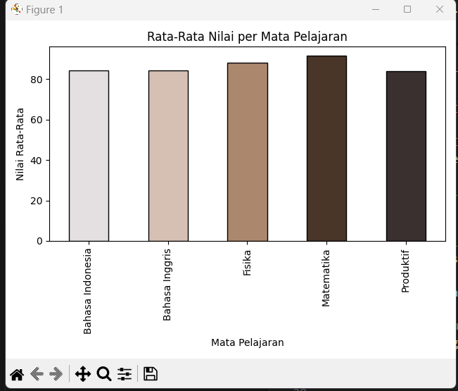

# ============================================================
#  📊 Analisis Nilai Siswa
#  Penulis : [Shafira Setia Andari Azzahra]
#  Deskripsi :
#  Program ini membaca data nilai siswa dari file CSV,
#  menampilkan ringkasan statistik, dan membuat grafik
#  rata-rata nilai per mata pelajaran.
# ============================================================

import pandas as pd
import matplotlib.pyplot as plt
import seaborn as sb

# === 1. Baca file CSV ===
# Gunakan pemisah ';' sesuai format file
data = pd.read_csv('nilai_siswa.csv', sep=';')

# === 2. Tampilkan informasi dasar ===
print("=== INFO DATA ===")
print(data.info())

print("\n=== 5 BARIS PERTAMA ===")
print(data.head())

print("\n=== DESKRIPSI NUMERIK ===")
print(data.describe(include='all'))

# === 3. Pastikan kolom 'Nilai' bertipe numerik ===
data['Nilai'] = pd.to_numeric(data['Nilai'], errors='coerce')

# === 4. Cek apakah ada nilai kosong setelah konversi ===
if data['Nilai'].isna().any():
    print("\n⚠ Ada nilai kosong setelah konversi:")
    print(data[data['Nilai'].isna()])

# === 5. Hitung nilai maksimum dan minimum per mata pelajaran ===
agg_minmax = data.groupby('Matpel')['Nilai'].agg(['max', 'min'])
print("\n=== MAX & MIN per Matpel ===")
print(agg_minmax)

# === 6. Hitung rata-rata nilai per mata pelajaran ===
rata = data.groupby('Matpel')['Nilai'].mean()
print("\n=== RATA-RATA per Matpel ===")
print(rata)

# === 7. Visualisasi: Bar Chart Rata-Rata Nilai ===
warna = ['#E4E0E1', '#D6C0B3', '#AB886D', '#493628', '#3B3030']

rata.plot(kind='bar', color=warna[:len(rata)], edgecolor='black')
plt.title('Rata-Rata Nilai per Mata Pelajaran')
plt.xlabel('Mata Pelajaran')
plt.ylabel('Nilai Rata-Rata')
plt.tight_layout()
plt.show()

# === 8. (Opsional) Visualisasi tambahan: Boxplot Sebaran Nilai ===
# sb.boxplot(x='Matpel', y='Nilai', data=data)
# plt.title('Sebaran Nilai per Mata Pelajaran')
# plt.tight_layout()
# plt.show()

